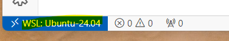

# Goal
Have isolated environment where we can run tests on database in CI/CD flow independently (as well as in any other environment including local).

For that purpose, we will need to maintain the database scripts that can create required databases with required structure from scratch and fill it with appropriate data on each run. Similar too [this](https://raw.githubusercontent.com/Microsoft/sql-server-samples/master/samples/databases/northwind-pubs/instnwnd.sql).
Such scripts can be easily auto generated in tools like [SQL Management Studio](https://learn.microsoft.com/en-us/sql/ssms/scripting/generate-scripts-sql-server-management-studio?view=sql-server-ver16).
Ourside responsibility will be to embed updating these scripts into release process.

The current implementation doesn't publish created images and does it only locally, but image publish is required step normally.

# How to

## Environment (for local tests)
This approach requires a docker container engine. We have few options to get it:
* Docker Desktop - easiest approach, but requires a license.
* Configure next docker related steps on Linux / MacOS operating system.
* Install/Use WSL2 (Windows Subsystem for Linux) on Windows and configure docker there.

This guide uses WSL2.

### Installing WSL2
See this article for [details](https://learn.microsoft.com/en-us/windows/wsl/install)

Recommended distro for this tutorial is `ubuntu-24.04` (`ubuntu` is also fine):

     wsl --install -d ubuntu-24.04

During installation, you will be asked to provide your new UNIX [credentails](https://learn.microsoft.com/en-us/windows/wsl/setup/environment#set-up-your-linux-username-and-password).

### Visual Studio code
After installing WSL, you can open its terminal from [Visual Studio Code](https://learn.microsoft.com/en-us/windows/wsl/tutorials/wsl-vscode)
which will lead to:

#### Intalling Docker
Next step is installing `docker` via the below steps:

    1. `git clone` this repository (or you can use your mounted main filesystem: `/mnt/c/PATH_TO_THIS_PROJECT`).
    2. Open this repository in VS code terminal.

Main steps can be found [here](https://docs.docker.com/engine/install/ubuntu/#install-using-the-repository).

#### Set up Docker's apt repository:
    3. sudo apt-get update
    4. sudo apt-get install ca-certificates curl
    5. sudo install -m 0755 -d /etc/apt/keyrings
    6. sudo curl -fsSL https://download.docker.com/linux/ubuntu/gpg -o /etc/apt/keyrings/docker.asc
    7. sudo chmod a+r /etc/apt/keyrings/docker.asc

#### Add the repository to Apt sources:
    8.
    echo \
      "deb [arch=$(dpkg --print-architecture) signed-by=/etc/apt/keyrings/docker.asc] https://download.docker.com/linux/ubuntu \
      $(. /etc/os-release && echo "$VERSION_CODENAME") stable" | \
      sudo tee /etc/apt/sources.list.d/docker.list > /dev/null
    9. sudo apt-get update

#### Install the Docker packages:
    10. sudo apt-get install docker-ce docker-ce-cli containerd.io docker-buildx-plugin docker-compose-plugin

#### Verify that the installation is successful by running the hello-world image:
    11. sudo docker run hello-world

## Run images
### Sql server image
    cd Prepare
    sudo ./prepare_sql_image.sh

The above script will open a terminal from a new docker image. To query database it's possible to use preinstalled `sqlcmd` tool via:

     sqlcmd -S "localhost" -U "sa" -P "SQLServer2017"
     1> select * from sys.databases
     2> go

where `GO` command is responsible for executing previously created queries.

It's also possible to launch SQL queries from the file (though this file will be executed automatically during docker compose flow further):

     sqlcmd -S "localhost" -U "sa" -P "SQLServer2017" -i /usr/share/instnwnd.sql

this command can be found in `apply_sql_changes` file, where `/usr/share/instnwnd.sql` is specified in the initial Dockerfile and consist of all scripts from https://raw.githubusercontent.com/Microsoft/sql-server-samples/master/samples/databases/northwind-pubs/instnwnd.sql.

### .NET integration tests image

    cd Prepare
    sudo ./prepare_integration_tests_image.sh

The above command will create a docker image with .NET integration tests

NOTE: to print logs from the container directly, use the below commands:

    sudo docker logs -n 10000 integration-tests
    sudo docker logs -n 10000 sql-server

### Docker compose installation
Used to orchestrate working with containers.

See this [guide](https://docs.docker.com/compose/install/linux/):

    sudo apt-get update
    sudo apt-get install docker-compose-plugin

To validate that it's installed:

    docker compose version

The below command will run everything:

    sudo docker compose -f docker-compose.yml  up --exit-code-from integration-tests

To validate launched compose images, use:

    sudo docker compose ps

To look at logs for containers:

    docker compose logs 

or for the specific container:

    docker-compose logs --follow container_name

# FAQ:

* In case of encoding issues for a script file use the following command:

      sudo apt install dos2unix
      dos2unix script_file.sh